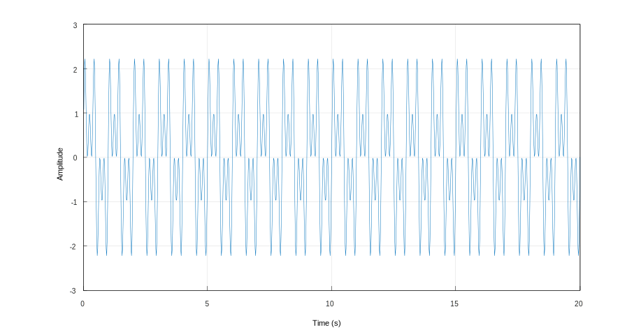
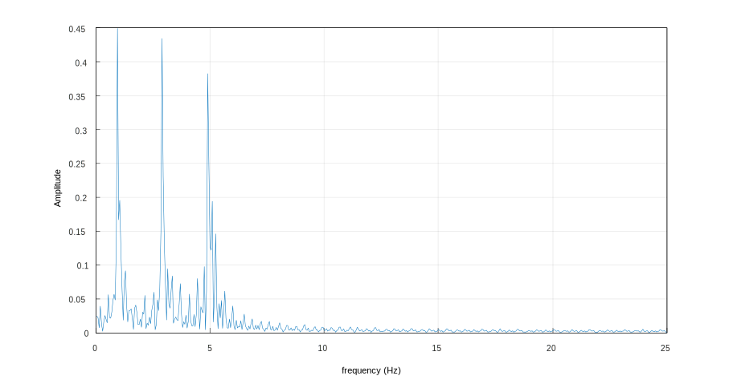

# Fast Fourier Visualizer

## What am I trying to achieve here?

Most of my code ends up in private repositories, so I want to show that I can deliver a mini-project from start to finish.  
This is becoming relevant during my 2025 job search.

I have designed this project to showcase how I handle dependencies, that I can adapt myself to multiple styles/paradygms of coding and that I have an extensive knowledge of the STL.

## How to build

Currently this repo has been proven to work with:
 - [x] Arch Linux (Omarchy)
 - [ ] Windows
 - [ ] Mac

1. Open the repository with VS Code.
1. Install the recommended extensions (open the extensions menu and look for `@recommended`).
1. Install the required programs (you also need c++23 compiler)
1. Open `src/main.cpp` and hit <kbd>F7</kbd>

## Example of the program running

running the program with 

```
build/fastfouriervis --input demo
```

Will generate a signal and a visualization will be shown on screen



The demo signal is defined by the following formula

```
τ = 2*pi
f(t) = sin(τ * t) + sin(3 * τ * t) + sinWave(5 * τ * t);
```

Hitting <kbd>Enter</kbd> in the command line starts the computation of the DFT using its definition (see https://en.wikipedia.org/wiki/Discrete_Fourier_transform)

Once computed it is shown to the user


Then, hitting <kbd>Enter</kbd> again starts the computation of the DFT using the FFT method

Once computed it is shown to the user



## To be added

- Fuzz Testing

## Contributors 

Just me and the occasional question to chatgpt/google.

(No AI was used from within the repo and all code was hand written)

# Known Problems and Issues

There seems to be a bug with the plot lib library I am using and it seem to flood the console.

Here's a work-around
```
build/fastfouriervis --input demo 2> /dev/null 
```

